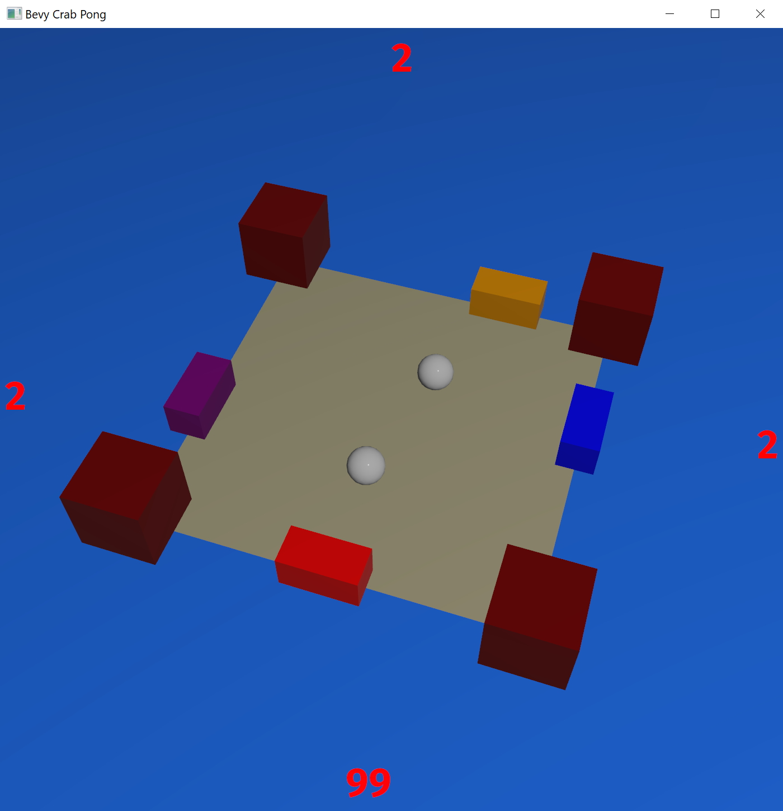

# Bevy Crab Pong

A Bevy Engine port of the [Video Tutorials Rock](http://www.videotutorialsrock.com/index.php) final project [Crab Pong](http://www.videotutorialsrock.com/opengl_tutorial/crab_pong/home.php).

## To Run

To compile and run, use [cargo](https://www.rust-lang.org/learn/get-started):

```shell
cargo run --release
```

## Screenshot



## TODO

- [ ] Add "reflections" in the ocean via mirrored geometry and ocean blending.
- [ ] Add a Ferris model (eg. [Ferris the Crab](https://sketchfab.com/3d-models/ferris-the-crab-e9bc16e19d1c4880b30d2aa5fd174887))?
- [ ] Adjust model textures to support color tinting.
- [ ] Try to mimic the lighting of the original.
- [ ] Add shadowed directional light for the sun?
- [ ] Use a Rust gear logo texture?
- [ ] Add proper mesh text for in-world UI? (eg. [Bevy Text Mesh](https://github.com/blaind/bevy_text_mesh))
- [x] Add multiplayer support.
- [x] Add gamepad support.
- [x] Add ocean texture scrolling.
