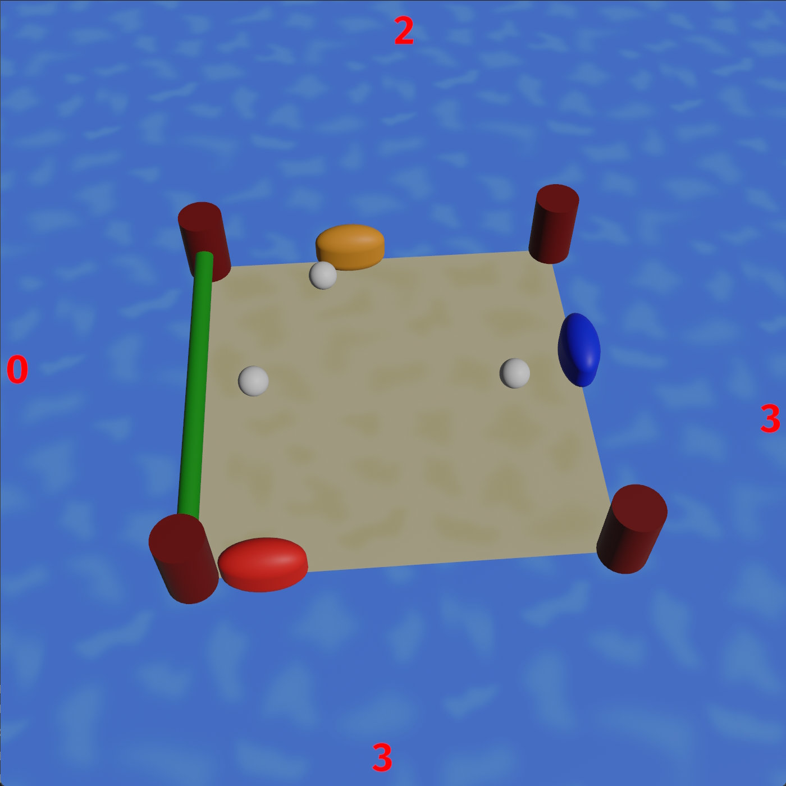

# Bevy Crab Pong

A Bevy Engine port of the [Video Tutorials Rock](http://www.videotutorialsrock.com/index.php) final project [Crab Pong](http://www.videotutorialsrock.com/opengl_tutorial/crab_pong/home.php).

## To Run

To compile and run, use [cargo](https://www.rust-lang.org/learn/get-started):

```shell
cargo run --release
```

## Screenshot



## TODO

- [x] Set up a basic Bevy engine project.
- [x] Add config files for all game settings.
- [x] White box the scene with tinted quads & cubes.
- [x] Add repeating slow swaying motion on camera.
- [x] Add placeholder 2D UI elements.
- [x] Add two balls that launch in random directions in succession.
- [x] Add Game Over state that resets the game.
- [x] Add crab visibility system to grow/shrink them into/from view.
- [x] Get ball return working.
- [x] Get win condition working.
- [x] Fade out crabs, remove them, and add barrier on their side when their score reaches zero.
- [x] Get score decrementing on goal working.
- [x] After a ball passes a goal fade it out and reset it while decrementing that goal's score.
- [x] Add ball visibility system to fade them into/from view.
- [x] Get bounded crab walking working.
- [x] Add acceleration to crab movement.
- [x] Add crabs AI.
- [x] Get balls bouncing around inside 4 walls.
- [x] Get balls bouncing off of 4 barriers.
- [x] Get balls bouncing off of 4 crabs.
- [x] Get balls bouncing off each other.
- [x] Add new game and game over messages UI.
- [x] Switch balls to opacity and alpha-blending for fading from view.
- [x] Added logging for game events and systems.
- [x] Add "reflections" in the water via mirrored geometry and water blending.
- [ ] Switch to RT-based in-world UI.
- [ ] Add a Ferris model (eg. [Ferris the Crab](https://sketchfab.com/3d-models/ferris-the-crab-e9bc16e19d1c4880b30d2aa5fd174887))
- [ ] Adjust model textures to support color tinting.
- [ ] Use updated scene textures rather than the originals?
- [ ] Add water texture scrolling.
- [ ] Try to mimic the lighting of the original.
- [ ] Add shadowed directional light for the sun?
- [ ] Use a Rust gear logo texture?
- [ ] Add proper mesh text for in-world UI? (eg. [Bevy Text Mesh](https://github.com/blaind/bevy_text_mesh))
